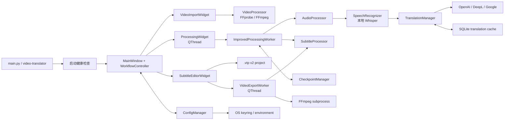

# VideoTranslator 架构

本文描述当前桌面应用的实际执行路径。判断活动代码应以 `main.py` 和导入关系为
准；带 `new`、`original` 后缀的翻译模块现在只是弃用兼容入口，不再保存第二套
提供商实现。

## 运行时总览



活动 GUI 流程为：

1. `main.py` 建立日志、临时文件管理器和 Qt 应用，执行本机健康检查。
2. `MainWindow` 用 `WorkflowController` 在导入、处理、编辑三个页面之间传递路径、
   语言和结果。
   已有字幕时，主窗口先用独立 `SubtitleProcessor` 解析文件，成功后才
   原子替换编辑会话，并可绕过处理页直接进入编辑器。
3. `ProcessingWidget` 把 `ImprovedProcessingWorker` 移入 QThread；工作器按顺序
   调用音频、Whisper、翻译和字幕模块。
4. 完成后的片段进入 `SubtitleEditorWidget`；项目保存仍在 GUI 线程中完成短小的
   JSON 原子写入。
5. 导出交给独立 `VideoExportWorker`，字幕文件和 FFmpeg 产物先写到目标目录的
   临时路径，再用 `os.replace` 提交。

## 主要模块

| 模块 | 职责 | 重要边界 |
| --- | --- | --- |
| `app/config.py` | 默认配置、最近文件、主题、API 密钥访问 | JSON 不包含密钥；钥匙串失败时只保留会话值 |
| `app/core/video.py` | 探测、缩略图、抽取与视频字幕操作 | 依赖系统 FFmpeg/FFprobe |
| `app/core/audio.py` | 音频提取、SoundFile 分块处理、重采样和分段 | 主 GUI 流程当前直接提取 WAV；并非所有预处理方法都会自动调用 |
| `app/core/speech.py` | 延迟加载 Whisper、转写、长音频分段辅助 | `openai-whisper`/PyTorch 为可选大依赖；标准单次转写不能即时取消 |
| `app/core/translation.py` | 三个云端适配器、优先级、故障转移、术语和缓存 | 只有成功结果写入缓存；无服务时返回显式失败 |
| `app/core/subtitle.py` | 字幕片段模型、解析、验证、合并/拆分与序列化 | GUI 可导入/导出 SRT、VTT、ASS/SSA、SBV 和 MicroDVD SUB |
| `app/gui/improved_processing.py` | 当前四阶段处理编排 | 串行执行，阶段边界协作式取消 |
| `app/gui/subtitle_editor.py` | 时间、文本、片段结构和媒体预览 | VLC 延迟加载；不可用时降级到 FFmpeg 静态帧 |
| `app/gui/video_export_thread.py` | 后台字幕/视频导出与取消 | FFmpeg 子进程独立进程组；临时产物不直接覆盖目标 |
| `app/utils/checkpoint.py` | 恢复数据的设置绑定、校验和原子持久化 | 七天有效期；依赖临时产物仍存在 |

`app/gui/processing.py` 只负责处理页与 QThread 生命周期，实际阶段编排统一由
`ImprovedProcessingWorker` 完成。`app/core/translation_original.py` 与
`translation_new.py` 只把旧导入转发到 `app/core/translation.py`；新增功能和修复
必须落在活动模块，避免重新形成分叉。

## 核心数据契约

### 字幕片段

核心模型 `SubtitleSegment` 包含：

- `start_time`、`end_time`：秒，浮点数；
- `original_text`、`translated_text`：原文与译文；
- `index`：显示/序列化索引；
- `style`：ASS 等格式可使用的样式字典。

外部字典进入核心时，`create_from_segments()` 兼容 `start`/`start_time`、
`end`/`end_time`、`text`/`original_text` 和 `translation`/`translated_text`。
跨层新增字段应先更新这一规范化边界，再更新项目与导出测试。

### 处理结果

`ImprovedProcessingWorker` 成功信号携带字典，包含视频、临时音频、识别结果、
翻译结果、生成字幕路径、规范化 `segments` 和 `status=completed`。编辑器只依赖
视频路径和规范化片段；不应直接理解翻译提供商响应。

### `.vtp` v2

项目顶层固定为 `schema=videotranslator.project`、`version=2`，并保存绝对和
相对视频路径、源/目标语言及字幕片段。读取时优先解析相对路径，因此项目文件与
媒体目录整体移动后仍可打开；它仍是编辑会话文件，不是自包含媒体包。旧版顶层
片段列表只在读取端兼容。

### 翻译结果

`TranslationResult` 除原文、译文、语言、服务和置信度外，还用
`metadata.success` 与 `metadata.fallback` 区分真实译文和原文回退。调用方必须
检查这些字段；仅比较文本是否变化并不可靠。

## 线程与取消语义

```mermaid
sequenceDiagram
    participant UI as GUI thread
    participant PW as Processing QThread
    participant EW as Export QThread
    participant F as FFmpeg process

    UI->>PW: start processing
    PW->>PW: audio → speech → translation → subtitle
    UI-->>PW: set cancellation event
    PW-->>UI: cancelled at a safe boundary

    UI->>EW: start export
    EW->>F: spawn in a new process group
    UI-->>EW: set cancellation event
    EW-->>F: SIGTERM/terminate, then force if needed
    EW-->>UI: cancelled; destination unchanged
```

处理线程不使用 `QThread.terminate()`。Python 无法安全杀死正在运行的 Whisper
函数，所以处理取消只设置线程安全事件，并在阶段或字幕片段边界检查。导出器能
直接控制自己创建的 FFmpeg 子进程，因此取消保证更强。

线程对象的终态信号负责退出 QThread，主窗口在 `finished` 后释放引用。任何新增
后台工作都应有唯一终态、重复启动保护、有界关闭流程，并测试失败/取消后的清理。

## 持久化与原子性

| 存储 | 默认位置 | 内容 | 提交方式 |
| --- | --- | --- | --- |
| 配置 | 应用配置目录下 `config.json` | 普通设置、最近文件 | 同目录临时文件、fsync、`os.replace` |
| 密钥 | OS keyring / 环境变量 | 提供商 API 密钥 | 不进入配置 JSON |
| 检查点 | 应用状态目录下 `checkpoints/` | 阶段结果、设置、路径 | 私有临时 JSON、fsync、`os.replace` |
| 翻译缓存 | 应用缓存目录下 `translation-cache.db` | 成功原文/译文与元数据 | SQLite WAL、进程内锁 |
| 项目 | 用户选择的 `.vtp` | v2 项目数据 | 同目录临时文件、fsync、`os.replace` |
| 导出 | 用户选择目录 | 字幕或视频 | 同目录临时产物、确认后 `os.replace` |

使用同目录临时文件可避免跨文件系统 rename 问题。导出开始后如果目标意外出现，
且用户没有预先确认覆盖，提交阶段会拒绝替换。

应用缓存目录遵循平台习惯：Linux 为 `${XDG_CACHE_HOME:-~/.cache}/video-translator`，
macOS 为 `~/Library/Caches/VideoTranslator`，Windows 为
`%LOCALAPPDATA%\VideoTranslator\Cache`。`VIDEOTRANSLATOR_CACHE_DIR` 可完整覆盖
该目录。日志位于应用状态目录的 `logs/`；状态目录同样支持
`VIDEOTRANSLATOR_STATE_DIR`，并在 Linux 优先遵循 `XDG_STATE_HOME`。
配置目录支持 `VIDEOTRANSLATOR_CONFIG_DIR`/`XDG_CONFIG_HOME`，检查点可用
`VIDEOTRANSLATOR_CHECKPOINT_DIR` 单独覆盖。

## 外部数据流

- FFmpeg、FFprobe、Whisper 和项目/字幕编辑在本机运行。
- 只有字幕文本、语言代码和必要翻译指令发往已配置的云端翻译服务。
- 视频和音频不由翻译适配器上传。
- 翻译缓存和检查点可能保留敏感原文/译文；它们不是加密数据库。
- 日志有敏感模式过滤，但异常消息来自多个外部库，分享前仍需人工审阅。

新增云端提供商时，应实现 `TranslatorInterface`，使用有界网络超时，把认证、
额度和协议错误映射为明确异常，并在文档中更新发送字段与保留风险。

## 依赖层

- 基础安装：Qt GUI、FFmpeg Python 封装、字幕工具、云端翻译适配器、缓存/配置
  和安全存储。
- `speech`：`openai-whisper` 与 PyTorch，启用视频语音转写。
- `media`：librosa 与 pydub，启用重采样与静音分段辅助能力。
- `playback`：python-vlc，启用实时预览（VLC 仍需系统原生库）。
- `full`：speech、media 与 playback 三层的合集。
- `dev`：pytest、pytest-qt、coverage、Ruff、mypy 与构建工具。
- 系统依赖：FFmpeg/FFprobe 必需；VLC 原生库为实时预览增强；CUDA 可选。

运行时对 Whisper 和 VLC 采用延迟或受保护导入，目的是让缺少增强依赖
时仍能启动并给出可操作提示，而不是把所有能力伪装成可用。

## 验证策略

默认测试重点保护外部协议、数据契约、线程/取消、原子写入、安全配置和 UI
降级路径。真实 API、GPU、VLC 窗口和多种 FFmpeg 编解码组合不进入默认 CI，
需要显式的集成环境和非仓库密钥。

测试入口和 legacy 边界见 [`tests/TEST_INDEX.md`](../tests/TEST_INDEX.md)。
